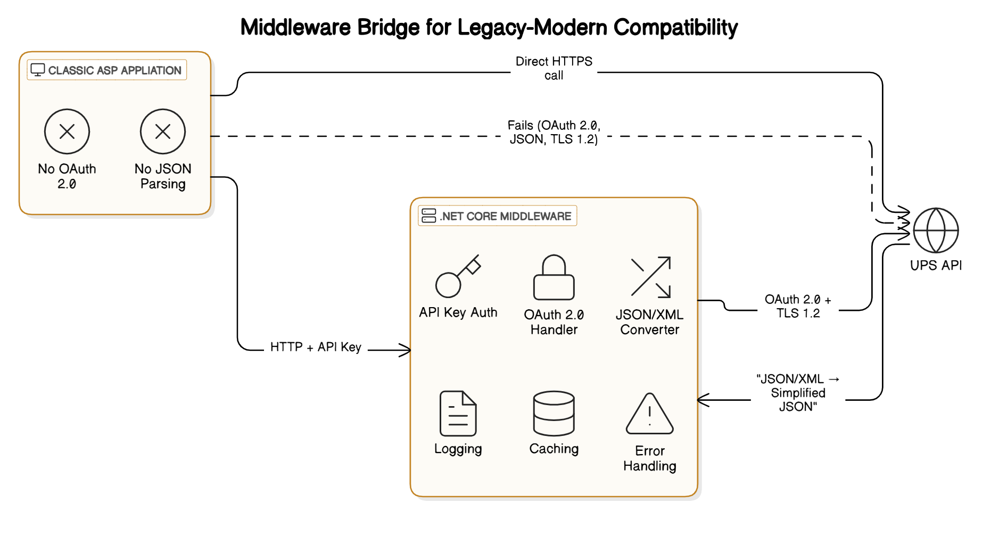

# UPS Shipping API Middleware POC

A .NET Core middleware service to integrate UPS APIs with legacy Classic ASP systems.

## Use Case
- Classic ASP websites cannot directly work with modern OAuth 2.0 APIs
- This middleware handles UPS authentication, API versioning, and JSON/XML conversion
- Legacy systems send simple requests to this middleware to get shipping rates

## Architecture Diagram



## Features
- OAuth 2.0 token management for UPS API
- XML-to-JSON conversion for legacy compatibility
- API key security layer
- Error logging
- Caching

## Prerequisites
- .NET 6 SDK
- UPS Developer Account (Client ID/Secret)
- Classic ASP server (for testing)

## Project Structure
```
UPSMiddlewarePOC/
├── UPSMiddlewarePOC.sln         # Solution file
├── UPSService/                  # .NET Core Middleware
│   ├── Controllers/             # API Controllers
│   │   └── UPSController.cs
│   ├── Middleware/              # Custom Middleware
│   │   ├── ApiKeyMiddleware.cs
│   │   └── ApiKeyMiddlewareExtensions.cs
│   ├── Models/                  # Data Models
│   │   ├── RateRequest.cs
│   │   └── UPSAuthResponse.cs
│   ├── Services/                # Service Layer
│   │   └── UPSApiService.cs
│   ├── appsettings.json         # Configuration
│   ├── appsettings.Development.json # Development Configuration
│   ├── Program.cs               # Application Entry Point
│   └── UPSService.csproj        # Project File
├── ClassicASPExample/           # Sample Legacy Integration
│   └── GetShippingRates.asp
└── README.md                    # Documentation
```

## Setup

1. **Clone Repository**
   ```bash
   git clone https://github.com/yourrepo/UPSMiddlewarePOC.git
   cd UPSMiddlewarePOC/UPSService
   ```

2. **Configure Credentials**

   Update appsettings.json:

   ```json
   {
     "UPS": {
       "ClientId": "your_ups_client_id",
       "ClientSecret": "your_ups_client_secret"
     },
     "ApiKey": "your_secret_middleware_key"
   }
   ```

3. **Run the Middleware**

   ```bash
   dotnet run
   ```
   
   Service will run at https://localhost:7270.

## Usage

### 1. Get Shipping Rates (via Middleware)

**Request (Classic ASP):**

```asp
<% 
Dim http, url, apiKey, responseText
url = "http://localhost:7270/api/ups/rates"
apiKey = "SECRET_KEY_123"

Set http = Server.CreateObject("MSXML2.ServerXMLHTTP.6.0")
http.Open "POST", url, False
http.setRequestHeader "Content-Type", "application/json"
http.setRequestHeader "X-API-Key", apiKey
http.Send "{""fromZip"":""10001"",""toZip"":""90001"",""weight"":5}"

If http.Status = 200 Then
    responseText = http.responseText
    Response.Write "UPS Rates:<br>" & responseText
Else
    Response.Write "Error: " & http.Status & " - " & http.statusText
End If
%>
```

**Sample Response:**

```json
{
  "GroundRate": "12.50",
  "AirRate": "28.75"
}
```

### 2. Direct API Testing (curl)

```bash
curl -X POST https://localhost:7270/api/ups/rates \
  -H "X-API-Key: your_secret_middleware_key" \
  -H "Content-Type: application/json" \
  -d '{"fromZip":"10001","toZip":"90001","weight":5}'
```

## Key Files

### UPSService/UPSService.csproj
```xml
<Project Sdk="Microsoft.NET.Sdk.Web">
  <PropertyGroup>
    <TargetFramework>net6.0</TargetFramework>
  </PropertyGroup>
  <ItemGroup>
    <PackageReference Include="Microsoft.AspNetCore.Mvc.NewtonsoftJson" Version="6.0.0" />
  </ItemGroup>
</Project>
```

### UPSService/appsettings.json
```json
{
  "Logging": {
    "LogLevel": {
      "Default": "Information",
      "Microsoft.AspNetCore": "Warning"
    }
  },
  "UPS": {
    "ClientId": "",
    "ClientSecret": ""
  },
  "ApiKey": "SECRET_KEY_123",
  "AllowedHosts": "*"
}
```

## Deployment

1. **Publish .NET Service**
   ```bash
   dotnet publish -c Release -o ./publish
   ```

2. **Host on IIS/Azure**
   - Deploy publish folder to server
   - Configure TLS 1.2+
   - Set environment variables for credentials

3. **Configure Classic ASP**
   - Update API endpoint URL in ASP code
   - Add error handling for HTTP status codes

## Security Notes
- Always use HTTPS in production
- Rotate API keys regularly
- Restrict middleware access to known IPs
